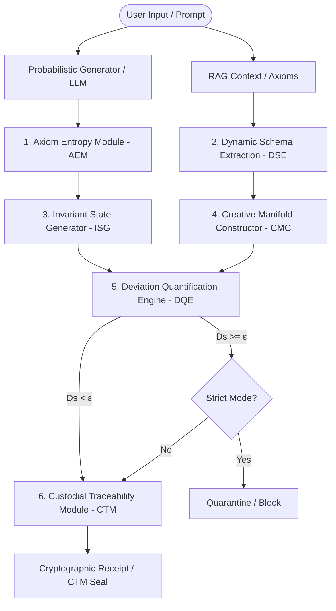

# IIAE Architecture & System Design Specification

This document defines the formal system architecture and operational layers of the **IIAE/IDICOC-DSE Framework**, as specified in the master technical specification (`IIAE_IDICOC-DSE.pdf`).

---

## 1. High-Level Architecture Overview

The Intelligent Invariant Audit Engine (IIAE) functions as a deterministic, mathematically grounded verification and enforcement layer that isolates and monitors stochastic neural generators (such as Large Language Models).

---

## 2. The Three Operational Layers

As defined in Section 5 of the core specification, the framework operates across three distinct systemic layers:

### A. Physical-Substrate Layer
* **Invariant State Generation (MAII-ISG)**: Projects latent embedding representations into a session-bounded Canonical Reference Form.
* **Fixed-Point Tolerance Threshold ($\delta_{fp}$)**: Within this resolution, the system enforces a quantization-relative uniqueness. This guarantees that representations within a defined distance map to identical canonical knowledge states, providing a stable baseline for verification.

### B. Logical-Dynamic Layer
* **Dynamic Schema Extraction (DSE)**: Identifies and structures transient context constraints ("Temporal Axioms") into a persistent, versioned **Property Graph** $G_t = (V_t, E_t)$ in real-time.
* **Creative Manifold Constructor (CMC)**: Defines the topologically constrained manifold of admissible output states. Modulated by the strictness parameter $\epsilon$, the CMC balances strict factual adherence ($\epsilon \to 0$) and creative expansion ($\epsilon \to 1$).
* **Deviation Quantification Engine (DQE)**: Measures structural distance (Dissonance Coefficient $D_s$) between proposed outputs and the manifold boundaries, triggering projection operators to return deviant states to the nearest admissible manifold state.

### C. Historical-Forensic Layer
* **Custodial Traceability Module (CTM)**: Governs the lifecycle of each generated element through an immutable **7-stage IDICOC** (Invariant Data Integrity Chain-of-Custody) pipeline, producing cryptographically sealed receipts in a Merkle DAG Ledger.

---

## 3. Core Functional Modules & Mathematical Formulations

### 1. Axiom Entropy Module (AEM)
Decomposes target outputs into structural signal and statistical entropy:
$$y_t = y_t^S + \eta_t$$
where $\eta_t$ represents statistical noise (quantization artifacts, stochastic drift, temperature fluctuations) which is segregated and stored in the **Entropy Map** $E_t$ for forensics, while structural signal $y_t^S$ is forwarded.

### 2. Invariant State Generator (ISG / MAII-ISG)
Establishes stable canonical representations from high-dimensional hidden states:
$$\hat{V}_t = \text{Canonicalize}(W_{equivariant} \cdot x_t)$$
Ensuring a deterministic mapping that is robust against numeric fluctuations up to the resolution limit $\delta_{fp}$.

### 3. Dynamic Schema Extraction (DSE)
Builds and maintains the versioned Property Graph representing the active conceptual constraints:
$$G_t = (V_t, E_t)$$
where vertices represent entities or conceptual assertions and edges represent logical, causal, or semantic relations.

### 4. Creative Manifold Constructor (CMC)
Calculates the dynamic strictly bounded manifold volume using a mathematically stable deterministic threshold formula:
$$\epsilon_t = 1.0 - \frac{1.0}{1.0 + \log_2(1 + N_{axioms})}$$
This ensures that as context axioms grow, the safety boundary automatically and deterministically scales.

### 5. Deviation Quantification Engine (DQE)
Computes the **Dissonance Coefficient** ($D_s$), representing the semantic/structural distance between the generated output and the Property Graph:
$$D_s = 1.0 - \frac{|\text{Words}(Response) \cap \text{Words}(Axioms)|}{|\text{Words}(Axioms)|}$$
The system classifies $D_s$ into four formal categories:
* **Standard-Zero** ($D_s = 0.0$): Perfect invariant preservation.
* **Tolerable** ($0.0 < D_s \le 0.4$): Safe conversational variation.
* **Violation** ($0.4 < D_s \le 0.8$): Structural divergence detected.
* **Critical** ($D_s > 0.8$): Immediate safety hazard.

### 6. Custodial Traceability Module (CTM)
Cryptographically seals interactions into an acyclic blockchain ledger. The seal is computed deterministically:
$$\text{CTM\_Seal} = \text{SHA-256}(\text{CanonicalJSON}(\text{Prompt}, \text{Response}, D_s, \text{Axioms}, \text{Parent\_Hash}))$$
This enforces end-to-end auditability and prevents retrospective tampering.
