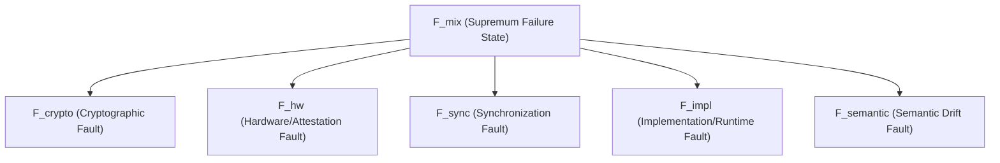

# Compliance Statement: EU AI Act Article 12 Alignment

The **IIAE/IDICOC-DSE Framework** is an enterprise-grade compliance substrate designed to meet the strict regulatory requirements of **Article 12 (Record-Keeping / Logging)** and **Article 15 (Accuracy, Robustness, and Cybersecurity)** of the **EU AI Act** for High-Risk AI Systems.

---

## 1. Regulatory Requirements & IIAE Mapping

### Article 12.1: Automatic Event Logging
> *“High-risk AI systems shall be designed and developed with capabilities enabling the automatic recording of events (‘logs’) while the high-risk AI system is operating.”*

* **IIAE Implementation**: The **Custodial Traceability Module (CTM)** natively records all input prompts, LLM generations, reference contexts, exact $D_s$ scores, and activated axiomatic structures.
* **Non-Repudiation**: Every log entry is sealed using a cryptographic Merkle DAG block hash (`SHA-256`), binding it to its predecessor state, creating an immutable history of AI operations.

### Article 12.2: Traceability & Auditability
> *“The logging capabilities shall ensure a level of traceability of the AI system’s functioning throughout its lifecycle that is appropriate to the intended purpose of the system.”*

* **IIAE Implementation**: Every state transition outputs a "Receipt of Reasoning" containing:
  - Exact active configuration variables ($\epsilon$, $\delta_{fp}$, and weights).
  - Explicit mapping to extracted/committed constraints.
  - Complete record of deviation corrections, acting as an immutable "flight recorder" for forensic audits.

### Article 15: Failure Isolation & Cyber Resilience
> *“High-risk AI systems shall be designed and developed in such a way that they are resilient as regards attempts by unauthorized third parties to alter their use, outputs or performance...”*

* **IIAE Implementation**: 
  - **Axiomatic Invariance Filtering**: Blocks "schema poisoning" or adversarial "gaslighting" attempts by rejecting temporal axioms that contradict committed hard invariants ($C_{hard}$).
  - **Non-Interference Isolation Domain**: Prevents contaminated tokens or unverified intermediate hidden states from executing or escaping containment before structural verification has concluded.

---

## 2. Formal Failure Lattice & Hazard Reporting

In compliance with rigorous certification standards, the framework implements a complete **Failure Lattice** ($\mathcal{F}$) allowing fine-grained classification and containment of complex multi-variable faults:

### Simultaneous Fault Supremum ($F_{mix}$)
If simultaneous faults are detected—such as a failure in Hardware attestation ($F_{hw}$) alongside a Clock/Timestamp desynchronization ($F_{sync}$)—the framework computes the supremum in the lattice:
$$F_{mix} = F_{hw} \sqcup_{\mathcal{F}} F_{sync}$$
Under any active $F_{mix}$ state:
1. The **CTM blocks all cryptographic sealing operations** (preventing the issuance of unverified receipts).
2. The supervisor halts the pipeline and triggers a **Structural Integrity Violation** alert, notifying enterprise security information systems (SIEM) natively in structured JSON.

---

## 3. Deployment & Conformity Assessment

The SDK is compliant with both standalone and nested conformity assessment pathways:
* **Embodiment A**: In-pipeline integration (enforces deterministic decoding at the logit space).
* **Embodiment B**: Supervisor middleware layer (checks and gates API-level completions, ideal for rapid bank RAG integrations).
