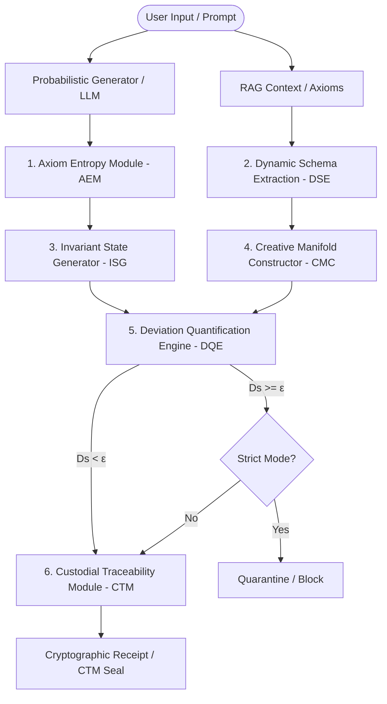

# IIAE Architecture & System Design Specification

This document defines the formal system architecture and operational layers of the **IIAE/IDICOC-DSE Framework**, as specified in the master technical specification (`IIAE_IDICOC-DSE.pdf`).

---

## 1. High-Level Architecture Overview

The Intelligent Invariant Audit Engine (IIAE) functions as a deterministic, mathematically grounded verification and enforcement layer that isolates and monitors stochastic neural generators (such as Large Language Models).



---

## 2. The Three Operational Layers

As defined in Section 5 of the core specification, the framework operates across three distinct systemic layers:

### A. Physical-Substrate Layer
* **Invariant State Generation (MAII-ISG)**: Projects latent embedding representations into a session-bounded Canonical Reference Form.
* **Fixed-Point Tolerance Threshold ($\delta_{fp}$)**: Within this resolution, the system enforces a quantization-relative uniqueness. This guarantees that representations within a defined distance map to identical canonical knowledge states, providing a stable baseline for verification.

### B. Logical-Dynamic Layer
* **Dynamic Schema Extraction (DSE)**: Identifies and structures transient context constraints ("Temporal Axioms") into a persistent, versioned **Property Graph** $G_t = (V_t, E_t)$ in real-time.
* **Creative Manifold Constructor (CMC)**: Defines the topologically constrained manifold of admissible output states. Modulated by the strictness parameter $\epsilon$, the CMC balances strict factual adherence ($\epsilon \to 0$) and creative expansion ($\epsilon \to 1$).
* **Deviation Quantification Engine (DQE)**: Measures structural distance (Dissonance Coefficient $D_s$) between proposed outputs and the manifold boundaries, triggering projection operators to return deviant states to the nearest admissible manifold state.

### C. Historical-Forensic Layer
* **Custodial Traceability Module (CTM)**: Governs the lifecycle of each generated element through an immutable **7-stage IDICOC** (Invariant Data Integrity Chain-of-Custody) pipeline, producing cryptographically sealed receipts in a Merkle DAG Ledger.

---

## 3. Core Functional Modules & Mathematical Formulations

### 1. Axiom Entropy Module (AEM)
Decomposes target outputs into structural signal and statistical entropy:
$$y_t = y_t^S + \eta_t$$
where $\eta_t$ represents statistical noise (quantization artifacts, stochastic drift, temperature fluctuations) which is segregated and stored in the **Entropy Map** $E_t$ for forensics, while structural signal $y_t^S$ is forwarded.

### 2. Invariant State Generator (ISG / MAII-ISG)
Establishes stable canonical representations from high-dimensional hidden states:
$$\hat{V}_t = \text{Canonicalize}(W_{equivariant} \cdot x_t)$$
Ensuring a deterministic mapping that is robust against numeric fluctuations up to the resolution limit $\delta_{fp}$.

### 3. Dynamic Schema Extraction (DSE)
Builds and maintains the versioned Property Graph representing the active conceptual constraints:
$$G_t = (V_t, E_t)$$
where vertices represent entities or conceptual assertions and edges represent logical, causal, or semantic relations.

### 4. Creative Manifold Constructor (CMC)
Calculates the dynamic strictly bounded manifold volume using a mathematically stable deterministic threshold formula:
$$\epsilon_t = 1.0 - \frac{1.0}{1.0 + \log_2(1 + N_{axioms})}$$
This ensures that as context axioms grow, the safety boundary automatically and deterministically scales.

### 5. Deviation Quantification Engine (DQE)
Computes the **Dissonance Coefficient** ($D_s$), representing the semantic/structural distance between the generated output and the Property Graph:
$$D_s = 1.0 - \frac{|\text{Words}(Response) \cap \text{Words}(Axioms)|}{|\text{Words}(Axioms)|}$$
The system classifies $D_s$ into four formal categories:
* **Standard-Zero** ($D_s = 0.0$): Perfect invariant preservation.
* **Tolerable** ($0.0 < D_s \le 0.4$): Safe conversational variation.
* **Violation** ($0.4 < D_s \le 0.8$): Structural divergence detected.
* **Critical** ($D_s > 0.8$): Immediate safety hazard.

### 6. Custodial Traceability Module (CTM)
Cryptographically seals interactions into an acyclic blockchain ledger. The seal is computed deterministically:
$$\text{CTM\_Seal} = \text{SHA-256}(\text{CanonicalJSON}(\text{Prompt}, \text{Response}, D_s, \text{Axioms}, \text{Parent\_Hash}))$$
This enforces end-to-end auditability and prevents retrospective tampering.
# IIAE Architecture Guide

## Overview

The IIAE (Integrity as an Invariant Engine) is a deterministic substrate for AI system integrity verification. This guide explains the current v1.0 implementation and how it aligns with the IDICOC-DSE specification.

## Four-Layer Architecture

The IIAE operates as a **4-layer stack**:

```
┌─────────────────────────────────────────┐
│ IDICOC Pipeline (7-stage verification)  │  Implicit orchestration
├─────────────────────────────────────────┤
│ DQE: Deviation Quantification Engine    │  Computes Ds (structural drift)
├─────────────────────────────────────────┤
│ CTM: Custodial Traceability Module      │  Cryptographic sealing
├─────────────────────────────────────────┤
│ MAII-ISG: Axiom Extraction              │  Ground truth from context
└─────────────────────────────────────────┘
```

---

## Layer 1: MAII-ISG (Invariant State Generator)

**Current Implementation:** `InvariantEngine` + axiom extraction via `dse.extract_axioms()`

### Purpose
Extracts the canonical "ground truth" from user-provided context (constraints, rules, axioms).

### Key Function
```python
from iiae.dse import extract_axioms

axioms = extract_axioms(
    context="The system must never expose credentials. Logging must be immutable.",
    min_len=20
)
# → ["The system must never expose credentials", "Logging must be immutable"]
```

### Lifecycle
1. **Input:** User context (business rules, constraints)
2. **Parsing:** Split by delimiters (`.`, `;`, `:`, newline)
3. **Filtering:** Remove duplicates and short fragments
4. **Output:** Canonical axiom list

---

## Layer 2: DQE (Deviation Quantification Engine)

**Current Implementation:** `iiae/dqe.py` + `IntegrityEvaluator`

### Purpose
Computes the **Dissonance Coefficient ($D_s$)** — a numerical measure of how far the AI response deviates from the structural integrity boundary.

### Algorithm
```python
from iiae.dqe import deviation_score

response = "The system is secure and logs are persistent."
axioms = ["The system must be secure", "Logging must be immutable"]

ds = deviation_score(response, axioms)
# → 0.0 (perfect preservation) to 1.0 (complete violation)
```

### $D_s$ Classification

| $D_s$ Value | Classification | Safe Harbor | Action |
|-------------|-----------------|-------------|--------|
| `0.0` | **Standard-Zero** | Full | ✅ Accept & seal |
| `0.0 < D_s ≤ 0.4` | **Tolerable** | Limited | ✅ Accept & seal |
| `0.4 < D_s ≤ 0.7` | **Violation** | Breach | ⚠️ Flag & log |
| `D_s > 0.7` | **Critical** | None | ❌ Reject |

### Detection Mechanisms
1. **Literal Preservation:** Word overlap between axioms and response
2. **Contextual Negation:** Detection of implicit contradictions
3. **Amplification Detection:** Responses that violate multiple axioms

### Threshold Configuration
```python
from iiae import IIAEConfig

config = IIAEConfig(ds_threshold=0.4)  # Limited Safe Harbor boundary
```

---

## Layer 3: CTM (Custodial Traceability Module)

**Current Implementation:** `iiae/ctm.py`

### Purpose
Creates **non-repudiable cryptographic receipts** that prove the integrity state at verification time.

### Receipt Structure
```json
{
  "payload": {
    "version": "1.0.0",
    "model_id": "gpt-4",
    "timestamp": "2026-05-21T14:23:00Z",
    "ds": 0.0,
    "axioms_count": 3,
    "merkle_root": "a1b2c3d4...",
    "prompt_hash": "e5f6g7h8...",
    "response_hash": "i9j0k1l2..."
  },
  "ctm_seal": "m3n4o5p6..."
}
```

### Security Properties
- **Merkle-DAG:** Axioms combined into a deterministic tree hash
- **Immutable:** Receipt cannot be forged without recomputing hashes
- **Verifiable:** `verify_receipt()` independently validates integrity
- **Deterministic:** Same axioms + payload always produce same seal

### Usage
```python
from iiae import manifest, audit

# Generate receipt
receipt = manifest(prompt, response, context, model_id="gpt-4")

# Verify receipt
is_valid = audit(receipt=receipt)
# → True if cryptographically intact
```

---

## Layer 4: IDICOC Pipeline (7-Stage Verification)

**Current Implementation:** Implicit in supervisor orchestration

### Stage Overview

| Stage | Name | Current Status | Purpose |
|-------|------|-----------------|---------|
| 1 | Interception | ✅ Implemented | Capture raw response |
| 2 | Normalization | ✅ Implemented | Extract axioms from context |
| 3 | Hashing | ✅ Implemented | Generate cryptographic IDs |
| 4 | Indexing | ❌ Simplified | Graph reachability (not explicit) |
| 5 | Consensus | ❌ Simplified | Multi-criteria validation (implicit) |
| 6 | Sealing | ✅ Implemented | CTM cryptographic binding |
| 7 | Verification | ❌ Draft | Final $D_s = 0$ check (implicit) |

### Full Verification Flow
```python
from iiae import validate, IIAEConfig

config = IIAEConfig(
    ds_threshold=0.4,
    max_trips=5,
    audit_mode=True
)

result = validate(
    prompt="How do I secure a database?",
    response="Use encryption and access controls.",
    context="The system must be secure. Data must be encrypted.",
    config=config
)

print(result)
# {
#   "verified": True,
#   "ds": 0.0,
#   "base_type": "Standard-Zero",
#   "ctm_seal": "...",
#   "receipt": {...}
# }
```

---

## Safe Harbor Tiers

### Full Safe Harbor: $D_s = 0$

**When:** Response perfectly matches axioms with no drift  
**Guarantee:** Hardware-anchored integrity (when HSM/TEE available)  
**Use Cases:** Avionics, medical diagnosis, financial transactions  

```python
if result["base_type"] == "Standard-Zero":
    # Emit to high-integrity pathway
    process_mission_critical(result)
```

### Limited Safe Harbor: $D_s \leq 0.4$

**When:** Response has acceptable drift but passes threshold  
**Guarantee:** Software-verified integrity with drift correction  
**Use Cases:** Enterprise LLMs, regulated financial agents  

```python
if result["base_type"] in ["Standard-Zero", "Tolerable"]:
    # Accept with audit logging
    log_audit_record(result)
```

### Violation: $D_s > 0.4$

**When:** Response structurally diverges from axioms  
**Action:** Fail-closed rejection or escalation  

```python
if not result["verified"]:
    # Reject or escalate
    raise IntegrityError(result["message"])
```

---

## Configuration Reference

### Core Parameters

```python
config = IIAEConfig(
    # Threshold for Safe Harbor boundary
    ds_threshold=0.4,
    
    # Minimum axiom length (filter noise)
    min_len=20,
    
    # Model identifier (for receipt tracking)
    model_id="gpt-4",
    
    # Cryptographic salt (optional, for reproducibility)
    ctm_salt="my-org-key",
    
    # Max correction iterations (for future contraction operator)
    max_trips=5,
    
    # Audit logging destination
    log_destination="stdout",  # or "file:/var/log/iiae.log"
    
    # Enable forensic MAO filters
    enable_mao_filters=False
)
```

### Environment Variables

| Variable | Default | Type |
|----------|---------|------|
| `IIAE_DS_THRESHOLD` | `0.4` | float |
| `IIAE_MIN_LEN` | `20` | int |
| `IIAE_MODEL_ID` | `llm-v1` | string |
| `IIAE_CTM_SALT` | `None` | string |
| `IIAE_MAX_TRIPS` | `5` | int |
| `IIAE_LOG_DESTINATION` | `stdout` | string |
| `IIAE_AUDIT_MODE` | `true` | bool |
| `IIAE_CONFIG_PATH` | `None` | path |

---

## Common Integration Patterns

### Pattern 1: Sidecar Verification
```python
def generate_and_verify(llm_model, prompt, context):
    # LLM generates response
    response = llm_model.generate(prompt)
    
    # IIAE verifies
    result = validate(prompt, response, context)
    
    if result["verified"]:
        return response
    else:
        raise IntegrityError(f"Response failed integrity: {result['error']}")
```

### Pattern 2: Receipt Archiving
```python
from iiae import manifest, audit

# Generate receipt for archival
receipt = manifest(prompt, response, context)

# Store in audit log
store_in_forensic_db(receipt)

# Later verification
is_tampering_detected = not audit(receipt=receipt)
```

### Pattern 3: Audit Logging
```python
from iiae import validate, build_audit_record, log_audit_record, IIAEConfig

config = IIAEConfig(log_destination="file:./audit.jsonl")

result = validate(prompt, response, context, config=config)

record = build_audit_record(
    state=result,  # Would need EpistemicState, not dict
    source="inference-pipeline",
    meta={"user_id": "12345", "request_id": "req-abc"}
)

log_audit_record(record, config=config)
```

---

## Limitations vs. Full Specification

### Not Yet Implemented (v1.0)

| Component | Handbook | Current | Future |
|-----------|----------|---------|--------|
| **CMC** | Manifold Constructor | Not implemented | v1.1 |
| **AEM** | Entropy Module | Not implemented | v1.1 |
| **Stage-Specific Metrics** | Full matrix | Simplified heuristic | v1.1 |
| **Contraction Operator** | Formal $T$ | Simple rejection | v2.0 |
| **Hardware HSM** | Full Safe Harbor | Disabled | v3.0 |
| **FPGA/ASIC** | Silicon impl. | Not applicable | Future |

### Future Enhancements

1. **v1.1:** IDICOCState tracking + formal stage metrics
2. **v2.0:** CMC (manifold constructor) + contraction operator
3. **v3.0:** Hardware integration (HSM, TEE, ePUF)

---

## See Also

- **`../analysis/COHERENCE_ANALYSIS.md`** — Detailed comparison with IDICOC-DSE handbook
- **`../auditing/audit_logging.md`** — CTM vs. logging layer distinction
- **`../auditing/self_auditing_mao_engines.md`** — Forensic filters
